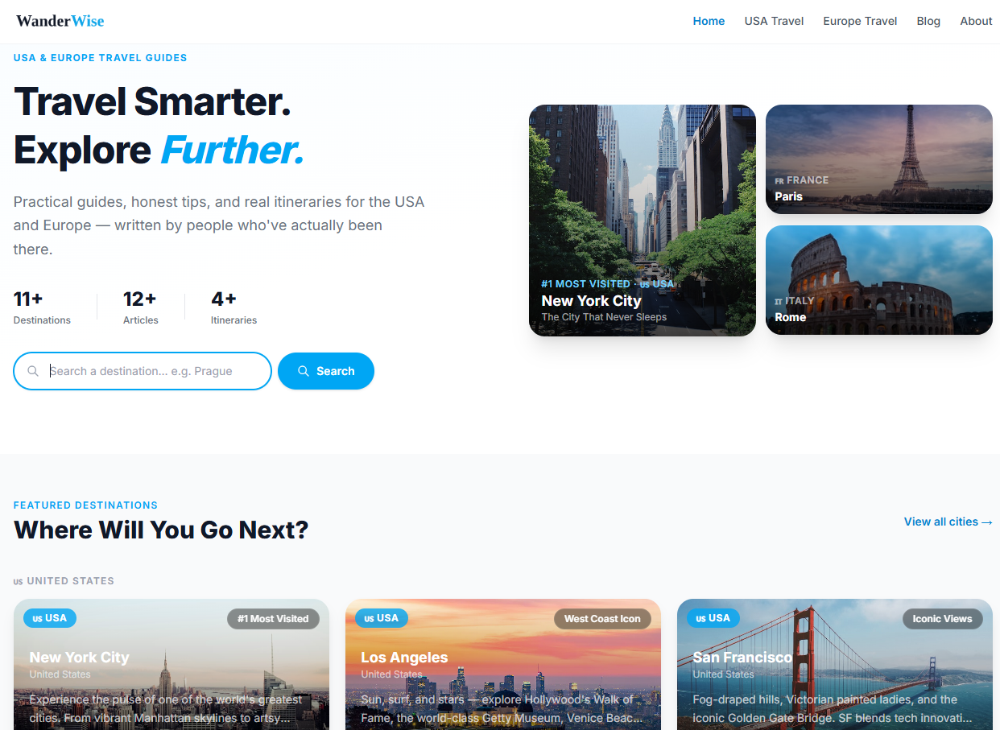
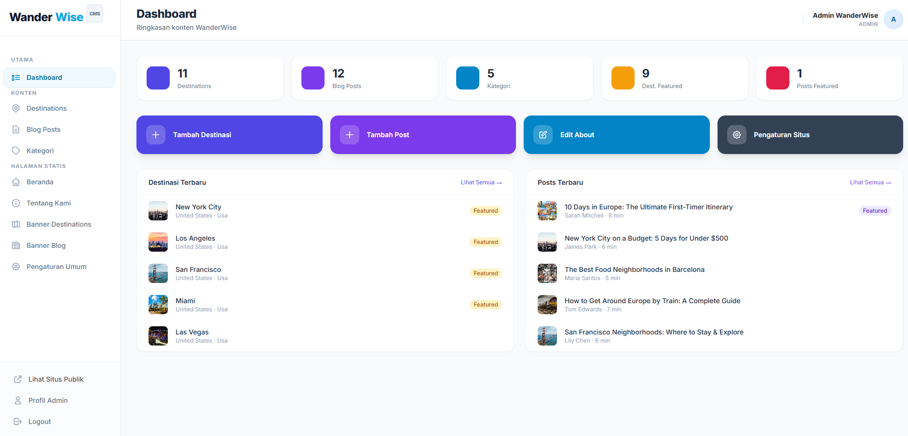

# 🌍 WanderWise

Proyek ini adalah platform informasi travel yang aku buat untuk belajar Laravel sekaligus mengerjakan projek web travel dari client. Fokusnya simpel: kurasi destinasi keren di USA dan Europe dalam satu website yang rapi dan gampang dipake.

WanderWise didesain buat traveler yang gak mau ribet nyari info di web yang penuh iklan. Semuanya dikurasi langsung lewat admin panel (CMS).

## Fitur Utama
- **Filter Pintar**: Bisa cari destinasi berdasarkan wilayah (USA/Europe) atau kategori (Budget, National Park, dll).
- **Live Search**: Cari destinasi secara *real-time* pake Alpine.js. Kalau gak ketemu, sistem bakal kasih saran kategori populer.
- **Admin Panel (CMS)**:
  - Edit konten (Destinasi, Blog, Kategori) dengan gampang.
  - Atur logo, link social media, dan deskripsi web langsung dari dashboard.
  - Warnai kategori sesuka hati biar tampilan makin menarik.

## Teknologi yang Dipakai
- **Core**: Laravel 10 (PHP 8.1+)
- **Frontend**: Blade Engine & Alpine.js
- **Styling**: Tailwind CSS (Custom Design)
- **Database**: MySQL

## Cara Install Sendiri

1. **Clone & Masuk Folder**:
   ```bash
   git clone https://github.com/helmidwianinnaim/wanderwise.git
   cd wanderwise
   ```
2. **Install Library**:
   ```bash
   composer install
   npm install && npm run dev
   ```
3. **Setup Database**:
   - Copy `.env.example` ke `.env`.
   - Jalankan `php artisan key:generate`.
   - Setup DB di `.env`, lalu jalankan `php artisan migrate --seed`.
4. **Jalankan**:
   ```bash
   php artisan serve
   ```

## 📸 Preview
Berikut beberapa tampilan WanderWise:

<p align="center">
  
  <br>
  <em>Tampilan Beranda - Bersih & Minimalis</em>
</p>

<p align="center">
  
  <br>
  <em>Dashboard Admin - Semua Kontrol di Sini</em>
</p>

---

Dibuat dengan ❤️ untuk portofolio. Semoga bermanfaat! ✌️

